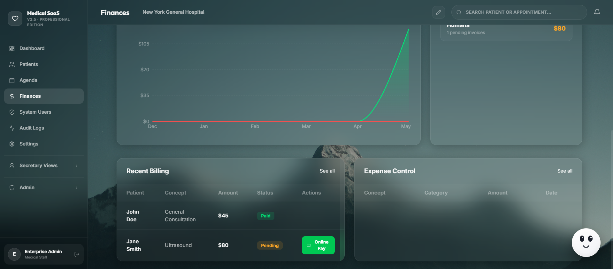
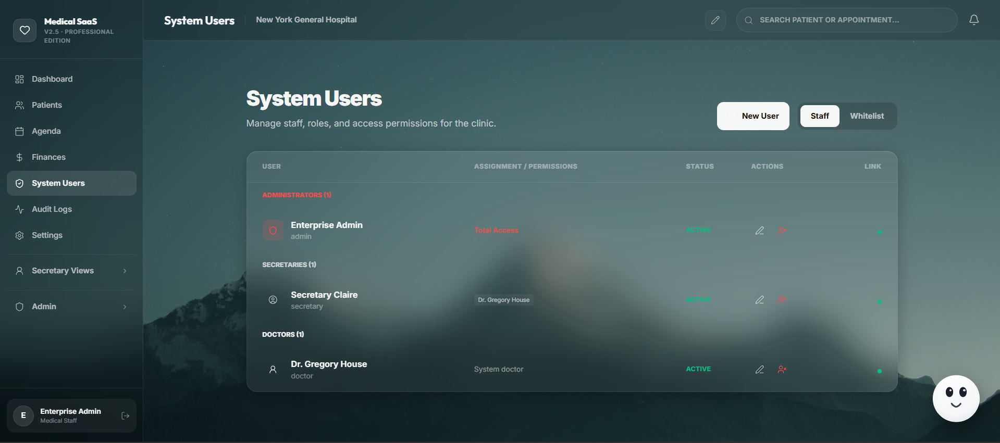

# Full-Stack Medical SaaS Boilerplate
### Enterprise-grade Clinical Management System with Privacy-First AI

[](https://opensource.org/licenses/MIT)
[](https://www.typescriptlang.org/)
[](https://www.postgresql.org/)
[](https://github.com/frangelbarrera/Medical-SaaS-Boilerplate/actions/workflows/ci.yml)

**Medical SaaS Boilerplate** is a production-grade Clinical Management System (CMS) designed for the modern medical era. It bridges the gap between complex clinical workflows and cutting-edge artificial intelligence, all while maintaining the highest standards of data sovereignty and cybersecurity.

> "Empowering medical professionals through precise intelligence and uncompromising security."


---

## Key Features by Role

### Administrators
*   **Global Clinic Control:** Manage staff, infrastructure settings, and multi-tenant configurations.
*   **Audit Forensics:** Complete traceability of every interaction within the system, crucial for compliance and security auditing.
*   **Financial Intelligence:** Real-time dashboards for revenue, expenses, and insurance claim tracking.

### Doctors
*   **AI Scribe:** Real-time consultation recording that automatically extracts vital signs, clinical evolution, and ICD-10 diagnoses.
*   **EHR Timeline:** A holistic, chronological view of a patient's entire medical history and diagnostic journey.
*   **Smart Chat Assistant:** Context-aware clinical assistant capables of querying patient records to provide diagnostic support.

### Secretariat
*   **Advanced Agenda:** High-performance appointment scheduling with real-time status tracking (Scheduled, Active, Completed, No-Show).
*   **Patient Intake:** Streamlined registration process with built-in validation for National IDs and clinical prioritization.
*   **Billing & Payments:** Direct integration with digital payment platforms (Payphone) and insurance management.

| Patient Directory | Medical Agenda |
| :---: | :---: |
|  |  |

---

## Cybersecurity & Architecture

As an application designed by and for engineering standards, Medical SaaS Boilerplate prioritizes a **Zero-Trust** and **Forensic-Ready** architecture:

*   **Auditability (Forensic Logging):** Every action (create, update, delete, login attempt) is recorded in an immutable audit trail, including IP addresses, User Agents, and detailed payload metadata.
*   **Strict Configuration (Zod Validation):** The backend utilizes **Zod** to perform runtime validation of all environment variables, ensuring that missing keys or insecure configurations prevent the system from starting in an unstable state.
*   **Data Integrity:** Engineered with **PostgreSQL**, utilizing relational constraints and JSONB indexing to ensure surgical precision in patient data handling.
*   **Role-Based Access Control (RBAC):** Strict permission layering ensures that users only access what they need. Sensitivity filters protect Electronic Health Records from unauthorized eyes.
*   **End-to-End Encryption:** JWT-based authentication with high-entropy secrets and BCrypt hashing for credential security.
*   **AI Sovereignty:** While supporting Cloud AI (Gemini), Medical SaaS Boilerplate is architected for local deployment with **Ollama**, ensuring patient data *never* leaves the physical clinic infrastructure if required.

### Educational Security Hardening (Current Implementations)
As an educational resource for cybersecurity in medical applications, the following mitigations have been successfully deployed in this boilerplate:

1. **Request Rate Limiting:** Global and Auth-specific rate limiting (`express-rate-limit`) to mitigate Brute Force attacks and Denial of Service (DoS) against login endpoints.
2. **Context Security Policies (CSP) & Headers:** Integration of `helmet` to mask Express server fingerprints (removing `X-Powered-By`), protecting against Clickjacking (X-Frame-Options), and mitigating Cross-Site Scripting (XSS).
3. **Payload Mitigation:** Express payload sanitization (`limit: '1mb'`) to prevent buffer overflows or oversized payload crashes (Billion Laughs / JSON dos).
4. **Token Expiry Governance:** JWT tokens enforce strict `8h` expiration windows to limit token hijack lifespans.
5. **HTTP-only Secure Cookies:** JWT tokens have been migrated out of `localStorage` (which is vulnerable to XSS extraction) and are now delivered via `HttpOnly`, `Secure`, `SameSite=Strict` cookies.
6. **Strict Payload Validation (Zod):** *All* API endpoints (`POST`, `PUT`) are now strictly guarded by Zod schema validations. This natively mitigates Mass Assignment vulnerabilities, unhandled exceptions from malformed inputs, NoSQL injection bypasses, and type-juggling attacks.
7. **CORS Governance:** Explicitly configured Cross-Origin Resource Sharing (CORS) strictly tied to the frontend origin securely avoiding wildcard data exposure.
8. **CSRF Header Protection:** Implemented custom Cross-Site Request Forgery (CSRF) header validation (`x-csrf-token: fetch`) relying on strict Same Origin pre-flights for state-altering requests.
9. **Application-Level Encryption (ALE) for PHI:** Strict PII and PHI fields (such as National IDs, Phone numbers, and Birthdates) are now dynamically encrypted and decrypted in transit using Node's native `crypto` module with AES-256-CBC, preventing data exposure if the operational database is compromised.
10. **Tamper-Evident Audit Logging:** Activity Audit Logs have been upgraded using cryptographic immutability (WORM-like). Each log entry computes a SHA-256 hash sealing its timestamp, payload, and the explicit hash of the *previous* log entry, creating a blockchain-like structure that instantly invalidates manual tampering.

### Product & UX Reliability Polish (Phase 2)
1. **Robust Notification Engine:** Replaced legacy, synchronous `window.alert()` calls (which pause JS execution and leak native browser styling) with asynchronous, accessible toast notifications utilizing `sonner`. This improves non-blocking flow and standardizes error awareness.
2. **Advanced Search Pipeline:** Built a debounced global search architecture indexing both Patients and Appointments simultaneously, preventing UI saturation and unnecessary re-renders while optimizing query processing limits.
3. **Data Visualization:** Integrated `recharts` for rich, interactive, dynamic area-chart visualization tracking historical appointments vs newly registered patients, optimizing macro-management workflows.
4. **Accessibility (a11y) Improvements:** Improved `aria-label` tags, refined visual hierarchy inputs, and fortified interactive fields with direct keyboard support (e.g. `Escape` key logic for exiting search contexts).
5. **Role-Contextual Session Timeouts (Inactivity Guard):** Implemented an intelligent client-side idle timeout mechanism. To balance security with clinical operational reality, the platform automatically logs out administrative/secretary roles after `15 minutes` of inactivity (reducing exposure risk in open-office environments), while doctors are granted a `30-minute` idle window to accommodate longer patient consultations without disruptive re-authentication flows.

| Financial Intelligence | Role-Based Access Control (RBAC) |
| :---: | :---: |
|  |  |

### Required Hardening for Production (HIPAA / GDPR Target)
While the boilerplate provides a strong foundation and robust application-layer security, the following **infrastructure** level configurations must be resolved before deploying natively to edge clusters or cloud providers:

1. **Dynamic Secrets Management:** Move away from local `.env` variables into enterprise secret vaults (AWS Secrets Manager, HashiCorp Vault) with automated rotation policies.
2. **Database Cloud Encryption-at-Rest:** Ensure operational disks are encrypted (AES-256) at the infrastructure level natively via the DB provider (e.g. AWS KMS).

---

## Project Structure

This project follows a scalable Full-Stack architecture pattern, combining an Express backend and a React frontend into a cohesive monolith optimized for deployment.

```text
├── server.ts              # Express Backend Entry Point & Secured API Routes
├── vite.config.ts         # Vite Configuration (Frontend bundling)
├── .env.example           # Example environment variables
├── package.json           # Project metadata and dependencies
├── src/
│   ├── App.tsx            # Main React Application, State Management & Role Routing
│   ├── main.tsx           # React DOM rendering entry point
│   ├── theme.ts           # Global UI color palette and styling variables
│   ├── components/        # Reusable UI Components & Role-based Views
│   │   ├── AIChat.tsx     # AI Chat Assistant Component
│   │   ├── Ico.tsx        # Centralized Iconography (Lucide-React)
│   │   └── ...            # Detailed clinical UI components
│   └── lib/               # Core Utilities and Business Logic
│       ├── api.ts         # Frontend HTTP Client (Fetch wrapper + CSRF & Cookies handling)
│       ├── ai-service.ts  # Integration with Google Gemini / AI models
│       ├── env.server.js  # Environment variables runtime Zod validation
│       └── swagger.js     # OpenAPI/Swagger documentation configuration
```

---

## Tech Stack

*   **Frontend:** [React 19](https://react.dev/), [Vite](https://vitejs.dev/), [Tailwind CSS](https://tailwindcss.com/)
*   **Logic:** [TypeScript](https://www.typescriptlang.org/) (Strict Mode)
*   **Animations:** [Motion](https://motion.dev/)
*   **Backend:** [Node.js](https://nodejs.org/) & [Express](https://expressjs.com/)
*   **Database:** [PostgreSQL](https://www.postgresql.org/)
*   **AI Engine:** [Google Gemini Pro API](https://ai.google.dev/) & [Ollama](https://ollama.com/)

---

### Database Architecture & In-Memory Mocking

For maximum portability and ease of testing, this MVP currently utilizes an **In-Memory Mock Database** directly managed within `server.ts`. This allows you to clone the repository and run the application instantly without configuring a local Postgres instance.

*   **Synthetic Data Generation:** Administrators can utilize the "Populate with Test Data" button within the Settings panel to rapidly inject synthetic patients, scheduled appointments, and clinical histories. **Important:** All synthetic data and mock profiles generated (names, ID numbers, clinical notes) are completely fictitious and generated randomly. They do not correlate to any real persons or actual patient records and are strictly for testing purposes. To maintain testing hygiene, this volatile test data is automatically purged upon admin logout.
*   **Production SQL Ready:** The backend API surface is fully demarcated to seamlessly swap the in-memory arrays for actual database transactions. A complete `schema.sql` file is included in the project root to initialize your production PostgreSQL instance when you are ready to scale.

---

## Quick Start

### 1. Installation
```bash
git clone https://github.com/frangelbarrera/medical-saas-fullstack-boilerplate.git
cd medical-saas-fullstack-boilerplate
npm install
```

### 2. Configuration
Create a `.env` file in the root directory:
```env
# Server Config
NODE_ENV=development
JWT_SECRET=your_high_entropy_secret_at_least_16_chars
ENCRYPTION_KEY=a_32_byte_hex_string_for_aes_256

# PostgreSQL
PGHOST=localhost
PGPORT=5432
PGUSER=your_user
PGPASSWORD=your_password
PGDATABASE=medical_saas_db

# External Payment Gateway
PAYMENT_GATEWAY_TOKEN=your_token
PAYMENT_GATEWAY_URL=https://api.gateway.com/prepare

# AI (Optional for Cloud)
GEMINI_API_KEY=your_google_api_key
```

### 3. Execution
```bash
# Develop
npm run dev

# Build for Production
npm run build
npm start
```

### 4. Default Credentials (Demo Access)
Upon initialization, the database automatically seeds the following credentials for immediate evaluation. **Important:** Change these passwords immediately in a production environment via the Admin Settings panel.

| Role | Username | Password | Access Level |
| :--- | :--- | :--- | :--- |
| **Administrator** | `admin` | `admin` | Full system access, audit logs, finances, and user management. |
| **Doctor** | `doctor` | `admin` | Clinical view, AI Scribe, patient consultations, and medical records. |
| **Secretary** | `secretary` | `admin` | Agenda management, patient intake, triage statuses, and billing. |

**DISCLAIMER / PROFESSIONAL WARNING:**

This project is an educational boilerplate and Minimum Viable Product (MVP). It is **NOT** intended for immediate production use with real Protected Health Information (PHI) out of the box. While application-level security features and encryption algorithms are structurally implemented, deploying this to a live environment requires extensive infrastructure-level hardening. This includes database encryption-at-rest natively on the provider (e.g., AWS KMS), professional secrets management, and certified HIPAA / GDPR compliance audits. The authors and contributors are not liable for any data breaches or non-compliance resulting from the unmodified deployment of this software.

---

## Documentation & CI/CD

### API Documentation (Swagger)
The platform includes built-in **Swagger/OpenAPI** documentation for developers. Once the server is running, you can access the interactive documentation at:
`http://localhost:3000/api-docs`

### CI/CD Workflow
We use **GitHub Actions** for continuous integration. Every commit is automatically validated through:
1.  **TypeScript Compilation**: Checks for type safety errors.
2.  **Linting**: Ensures adherence to enterprise code standards.
3.  **Production Build**: Verifies that the application compiles correctly for deployment.

---

## Security

For detailed information on our security approach and how to report vulnerabilities, please refer to our [SECURITY.md](SECURITY.md) file.

---

## Future Roadmap

*   **Local Sovereign AI:** Native deep integration with **Whisper** (Local Speech-to-Text) and **Llama 3** (via Ollama) to eliminate external API dependencies.
*   **DICOM Integration:** Support for medical imaging visualization (X-Rays, MRIs) directly in the patient timeline.
*   **HL7/FHIR Compliance:** Standardization for interoperability with other hospital systems.

---

## License

This project is licensed under the **MIT License** - see the [LICENSE](LICENSE) file for details.

Developed by **Frangel Barrera** (Cybersecurity Engineer).
