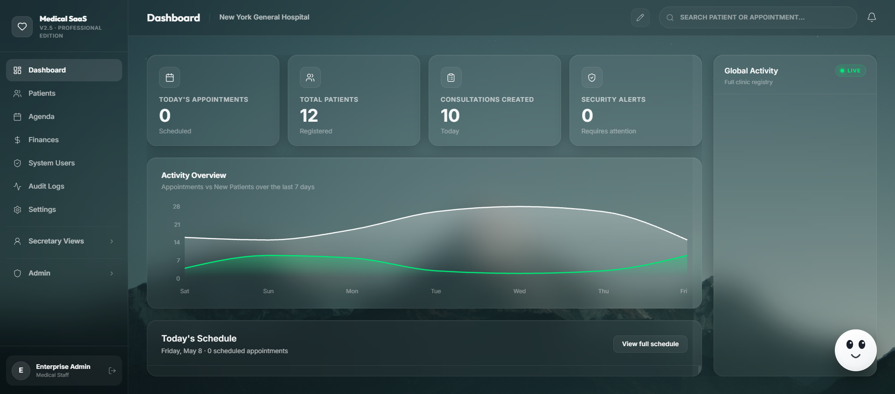
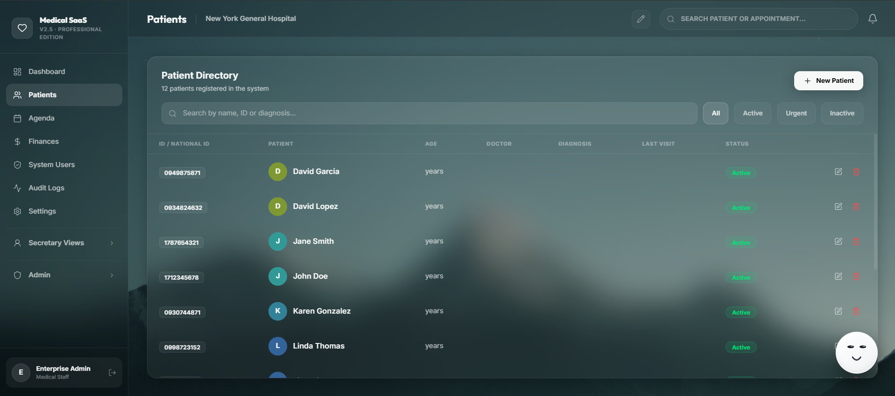
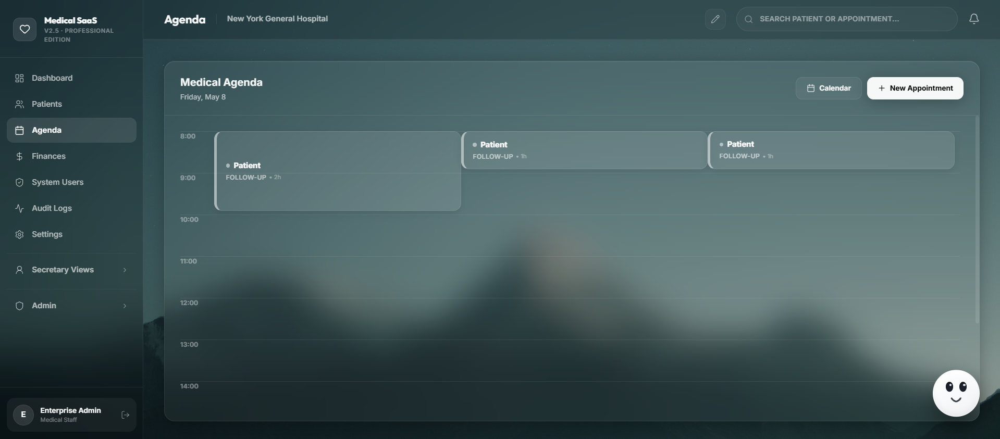

# Full-Stack Medical SaaS Boilerplate

### HIPAA-aware Clinical Management System with Privacy-First AI

[](https://opensource.org/licenses/MIT)
[](https://www.typescriptlang.org/)
[](https://www.postgresql.org/)
[](https://github.com/frangelbarrera/medical-saas-fullstack-boilerplate/actions/workflows/ci.yml)

A full-stack medical SaaS boilerplate with role-based access control, application-level encryption for PHI, tamper-evident audit logging, and an AI clinical assistant. Designed as a starting point for medical SaaS products — **not** a turnkey HIPAA-compliant product.

> **Disclaimer**: This boilerplate implements HIPAA-aware patterns (encryption at rest, audit trail, RBAC, minimum-necessary role isolation). It is **not** certified HIPAA-compliant. Before deploying with real Protected Health Information (PHI), you must complete infrastructure hardening, sign BAAs with all third-party vendors (Google for Gemini, your DB provider, etc.), and pass a formal HIPAA security risk assessment.



---

## Key Features by Role

### Administrators
- **Clinic Control**: Manage staff, infrastructure settings, and clinic configuration.
- **Audit Forensics**: Tamper-evident audit trail (SHA-256 hash chain) of every state-changing action.
- **Financial Intelligence**: Dashboards for revenue, expenses, and insurance claim tracking.

### Doctors
- **AI Scribe**: Mock endpoint that simulates extraction of vital signs, evolution, and ICD-10 diagnoses from consultation audio.
- **EHR Timeline**: Chronological view of a patient's medical history and diagnostic journey.
- **Smart Chat Assistant**: Context-aware clinical assistant that queries patient records (with PHI stripped before LLM calls).

### Secretariat
- **Agenda**: Appointment scheduling with status tracking (Scheduled, Active, Completed, No-Show).
- **Patient Intake**: Patient registration with national ID validation.
- **Billing & Payments**: Integration with digital payment platforms (Payphone) with HMAC-verified webhooks.

| Patient Directory | Medical Agenda |
| :---: | :---: |
|  |  |

---

## Security Architecture

### Authentication & Authorization
- **JWT** in `HttpOnly`, `Secure`, `SameSite=Lax` cookies (no `localStorage` exposure).
- **`__Host-` cookie prefix** in production (forces `Secure`, `Path=/`, no `Domain`).
- **RBAC middleware** (`requireRole(...)`) applied to every privileged endpoint. Role checks are enforced server-side, not just by hiding UI.
- **bcrypt** password hashing (cost factor 12).
- **Per-session CSRF token** (double-submit cookie pattern). The token is generated server-side on login and must be sent back as `x-csrf-token` header for state-changing requests.

### Multi-Tenant Isolation
- Every query filters by `clinicId` taken from the JWT (`req.user.clinicId`), **never** from the request body or query string.
- Resources that don't belong to the caller's clinic return `404` (not `403`) to avoid leaking existence.
- Self-protection: a user cannot delete their own account, change their own role, or deactivate themselves.

### Application-Level Encryption
- **AES-256-GCM** (authenticated encryption) for PHI fields: `dni`, `email`, `phone`, `birth_date`.
- The auth tag prevents ciphertext tampering (mitigates padding oracle and bit-flipping attacks).
- Ciphertext format: `iv:authTag:ciphertext` (all hex).
- `decryptPHI` throws on auth tag failure (never returns partial/decrypted data).
- `ENCRYPTION_KEY` is sourced from validated environment variables — the app crashes on startup if missing or malformed.

### Audit Trail
- Every state-changing operation (user/patient/appointment/consultation/invoice create/update/delete, payment events) is recorded via `appendAuditLog()`.
- Audit entries are created **server-side only** — the `POST /api/audit_logs` endpoint has been removed to prevent clients from forging entries.
- Each entry includes a SHA-256 hash of the previous entry (hash chain) for tamper-evidence.
- Audit logs are admin-only read.

### Payment Security
- **HMAC-SHA256 webhook verification** with constant-time comparison (`crypto.timingSafeEqual`).
- **Idempotency**: replayed webhooks are detected and skipped.
- **Timeout** (10s) on gateway requests to prevent slow-loris abuse.
- **Host Header Injection fix**: `responseUrl` and `cancellationUrl` use `FRONTEND_URL` env var instead of `req.get('host')`.

### AI / LLM Safety
- **PHI stripping** before sending data to Google Gemini (configurable via `LLM_PHI_MODE` env var):
  - `strip` (default): replace PHI fields with placeholders (`[PATIENT_NAME]`, `[PATIENT_ID]`, etc.)
  - `redact`: mask PHI partially (`J*** D**`)
  - `passthrough`: send PHI as-is (**requires signed BAA with Google**)
- The `GEMINI_API_KEY` is read server-side only — it is **never** exposed to the client bundle (the previous `vite.config.ts` `define` directive that leaked it has been removed).

### HTTP Security Headers
- **Content Security Policy** with explicit directives (production: strict, dev: permissive for Vite HMR).
- **HSTS** (1 year, includeSubDomains, preload).
- **COOP**, **CORP**, **Referrer-Policy: strict-origin-when-cross-origin**.
- `frame-ancestors: 'none'` (clickjacking mitigation).

### Rate Limiting
- Global: 500 requests / 15 min per IP.
- Auth: 20 login attempts / 15 min per IP.

### Body Size Limit
- `express.json` with `limit: '1mb'` to mitigate payload-based DoS.

---

## Required Hardening for Production (HIPAA / GDPR)

Before deploying with real PHI:

1. **Secrets Management**: Move `JWT_SECRET`, `ENCRYPTION_KEY`, `PAYMENT_WEBHOOK_SECRET` from `.env` to a secret vault (AWS Secrets Manager, HashiCorp Vault).
2. **Database Encryption at Rest**: Enable at the infrastructure level (AWS KMS, GCP CMEK).
3. **BAA with Google**: Required before using Gemini with PHI. Without a BAA, keep `LLM_PHI_MODE=strip`.
4. **TLS Termination**: Ensure HTTPS only at the load balancer / reverse proxy layer. Add HTTP→HTTPS redirect.
5. **Backup Strategy**: Encrypted backups with tested restore procedures. Define retention policy (HIPAA: 6 years minimum).
6. **Formal Risk Assessment**: Required by HIPAA Security Rule (45 CFR §164.308).
7. **Workforce Training**: HIPAA-required security awareness training for all users.
8. **Incident Response Plan**: Document breach notification procedures (60-day notification window per HITECH).

---

## Project Structure

```text
.
├── server.ts                  # Express backend (auth, RBAC, IDOR guards, audit, encryption)
├── schema.sql                 # PostgreSQL schema with RLS (for production DB mode)
├── Dockerfile                 # Multi-stage, non-root, slim
├── docker-compose.yml         # postgres + app with healthchecks and required secrets
├── .env.example               # Template with generation instructions
├── package.json
├── tsconfig.json              # Strict mode enabled
├── vite.config.ts             # Vite + proxy (no client-side secrets)
├── .github/workflows/
│   ├── ci.yml                 # typecheck + test + build + npm audit
│   └── deploy.yml             # SSH deploy (gated, commented by default)
├── public/
│   └── Screenshots/           # README images
└── src/
    ├── App.tsx                # React app, routing, role-based views, session timeout
    ├── main.tsx
    ├── theme.ts
    ├── index.css
    ├── components/            # 19 view components
    │   ├── AIChat.tsx
    │   ├── AIScribe.tsx
    │   ├── AdminUsersView.tsx
    │   ├── AgendaView.tsx / SecAgendaView.tsx
    │   ├── AuditView.tsx
    │   ├── ConsultationView.tsx
    │   ├── DashboardView.tsx / SecDashboardView.tsx
    │   ├── FinanceView.tsx
    │   ├── MedicalHistoryView.tsx
    │   ├── PatientDetailView.tsx
    │   ├── PatientsView.tsx / SecPatientsView.tsx
    │   ├── SettingsView.tsx
    │   └── ...
    └── lib/
        ├── api.ts             # Frontend HTTP client with dynamic CSRF token
        ├── ai-service.ts      # Gemini integration with PHI sanitization
        ├── env.server.ts      # Zod-validated env vars (no defaults for secrets)
        ├── swagger.ts
        ├── types.ts
        ├── validators.ts
        ├── cie10.ts           # ICD-10 catalog (ES)
        └── medications.ts
```

---

## Tech Stack

- **Frontend**: [React 19](https://react.dev/), [Vite 6](https://vitejs.dev/), [Tailwind CSS 4](https://tailwindcss.com/)
- **Language**: [TypeScript 5.8](https://www.typescriptlang.org/) (strict mode)
- **Animations**: [Motion](https://motion.dev/)
- **Backend**: [Node.js 20](https://nodejs.org/), [Express 4](https://expressjs.com/)
- **Database**: [PostgreSQL 15](https://www.postgresql.org/) (with in-memory mock fallback for dev)
- **AI Engine**: [Google Gemini](https://ai.google.dev/) (with PHI sanitization)
- **Testing**: [Vitest](https://vitest.dev/) + [Supertest](https://github.com/ladjs/supertest)
- **Security**: [Helmet](https://helmetjs.github.io/), [express-rate-limit](https://github.com/express-rate-limit/express-rate-limit), [bcryptjs](https://github.com/dcodeIO/bcrypt.js), [jsonwebtoken](https://github.com/auth0/node-jsonwebtoken), [zod](https://zod.dev/)

---

## Database Architecture

The boilerplate ships with two database modes:

### 1. In-Memory Mock (default, for development)
- 8 arrays (`mockUsers`, `mockPatients`, `mockConsultations`, etc.) managed in `server.ts`.
- Allows instant setup without a Postgres instance.
- Use the "Populate with Test Data" button in Settings to generate synthetic patients, appointments, and consultations.
- **Volatile test data is purged on admin logout.**

### 2. PostgreSQL (for production)
- `schema.sql` declares the full schema with:
  - UUID primary keys (`uuid-ossp` extension)
  - Row-Level Security (RLS) policies with `WITH CHECK` for INSERT/UPDATE
  - ENUM types for roles and statuses
  - Foreign keys with explicit `ON DELETE` actions
  - Indexes on foreign keys and `clinic_id` for multi-tenant query performance
- When PostgreSQL is available (`PGHOST`, `PGUSER`, `PGPASSWORD`, `PGDATABASE` set), `initDb()` connects and creates the `users` and `clinics` tables. To enable the full schema, run `psql -f schema.sql` against your database.

> **Note**: The mock arrays and the SQL schema currently diverge in column types. The encryption format produces hex strings of 60-100+ characters, so `VARCHAR(20)` columns in `schema.sql` for `identification_number` / `phone` must be widened to `TEXT` or `VARCHAR(255)` before deploying with real DB mode. See [DEPLOYMENT_GUIDE.md](DEPLOYMENT_GUIDE.md) for migration instructions.

---

## Quick Start

### 1. Clone & Install
```bash
git clone https://github.com/frangelbarrera/medical-saas-fullstack-boilerplate.git
cd medical-saas-fullstack-boilerplate
npm install
```

### 2. Generate Secrets
The app will refuse to start without valid secrets. Generate them with `openssl`:

```bash
# JWT_SECRET (min 32 chars, recommend 64 hex chars = 32 bytes)
openssl rand -hex 32

# ENCRYPTION_KEY (exactly 64 hex chars = 32 bytes for AES-256)
openssl rand -hex 32

# PAYMENT_WEBHOOK_SECRET (min 16 chars)
openssl rand -hex 16
```

### 3. Configure `.env`
```bash
cp .env.example .env
# Edit .env and replace all placeholders with real values
```

Required variables (no defaults — the app crashes if missing):
- `JWT_SECRET` — min 32 characters
- `ENCRYPTION_KEY` — exactly 64 hex characters (32 bytes)
- `PAYMENT_WEBHOOK_SECRET` — min 16 characters
- `FRONTEND_URL` — your frontend origin (for CORS and redirects)

Optional:
- `ADMIN_USERNAME` / `ADMIN_PASSWORD` — first admin credentials (if not set, no admin is seeded; you must provision one)
- `GEMINI_API_KEY` — for AI features (server-side only)
- `PAYMENT_GATEWAY_TOKEN` — for real payment integration
- `LLM_PHI_MODE` — `strip` (default) | `redact` | `passthrough` (BAA required)

### 4. Run
```bash
# Development (Vite HMR + tsx watch)
npm run dev

# Production
npm run build
npm start
```

### 5. First Login
If you set `ADMIN_USERNAME` and `ADMIN_PASSWORD` in `.env`, log in with those credentials. Change the password immediately via the Admin Settings panel.

If you did **not** set those env vars, no admin is seeded. Set them and restart the server to provision the first admin.

---

## Testing

```bash
# Run all tests once
npm test

# Watch mode
npm run test:watch

# With coverage
npm run test:ci
```

Tests use Vitest + Supertest. The suite covers:
- Auth (login success/failure, JWT verification, role enforcement)
- IDOR (cross-clinic access returns 404)
- Encryption (round-trip, auth tag failure throws)
- CSRF (state-changing requests without token are rejected)
- Payment webhook (signature verification, idempotency)

---

## CI/CD

Every push to `main` and every PR triggers `.github/workflows/ci.yml`:
1. **Typecheck** (`tsc --noEmit` with strict mode)
2. **Tests** (`vitest run` with test secrets)
3. **Build** (`vite build`)
4. **Security audit** (`npm audit --audit-level=high`, no `continue-on-error`)

Deploy workflow (`.github/workflows/deploy.yml`) is provided as a template — configure `SERVER_HOST`, `SERVER_USER`, `SERVER_SSH_KEY`, and `DEPLOY_PATH` secrets to enable SSH-based deployment.

---

## Security

For the security policy and vulnerability reporting, see [SECURITY.md](SECURITY.md).

---

## Roadmap

- **Local Sovereign AI**: Whisper + Llama 3 via Ollama for fully offline AI.
- **DICOM Integration**: Medical imaging in the patient timeline.
- **HL7/FHIR**: Interoperability with hospital systems.
- **Database migration tooling**: Replace mock arrays with real PostgreSQL queries, aligned with `schema.sql`.
- **Code-splitting**: Lazy-load view components to reduce initial bundle.

---

## License

MIT — see [LICENSE](LICENSE).

Developed by **Frangel Barrera** (Cybersecurity Engineer).
